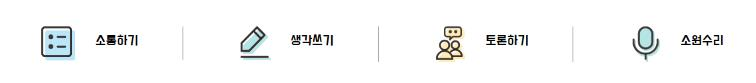
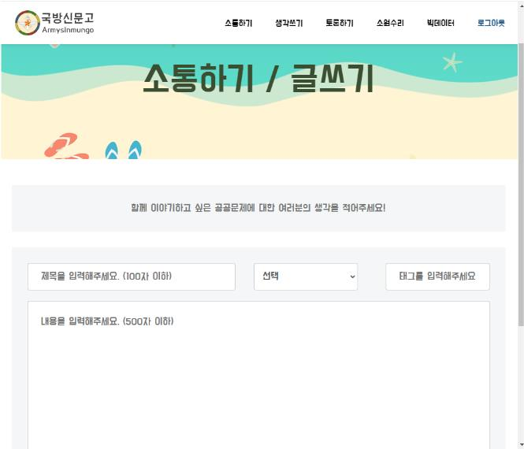
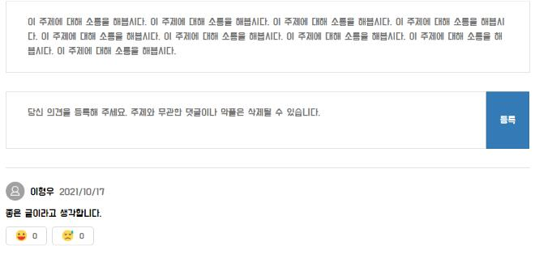
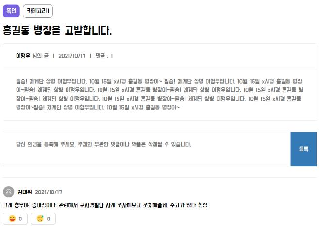
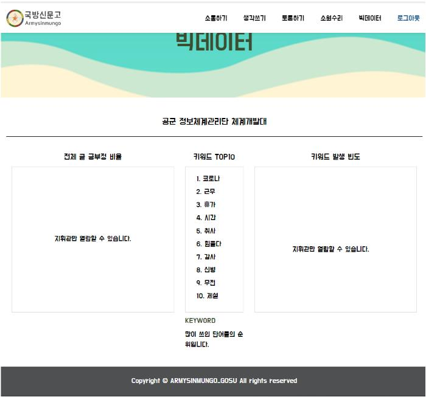
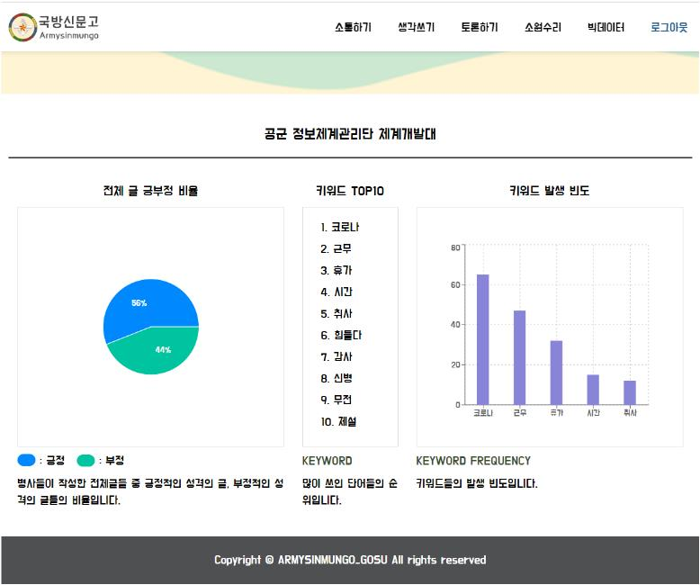
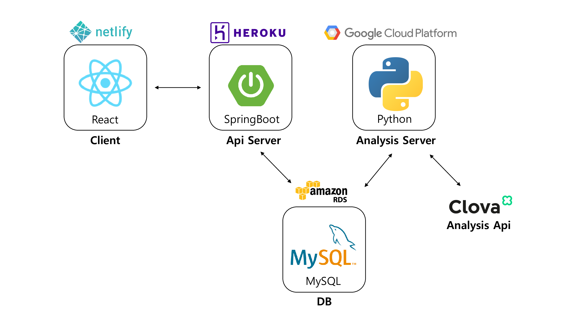
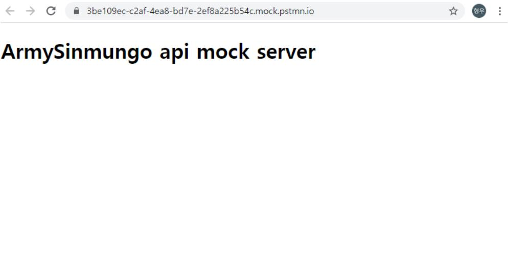
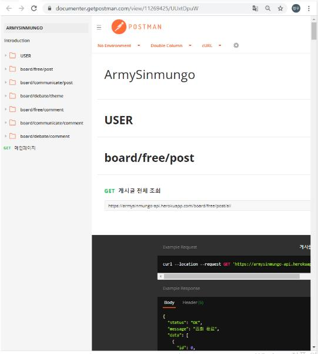

# 국방신문고 : Armysinmungo


<br>

### DEMO : https://armysinmungo.netlify.app/
<br>

## 프로젝트 소개
 ### &nbsp;&nbsp;프로젝트 배경
  &nbsp;&nbsp;이 프로젝트는 군 생활 중 장병들이 겪는 불편하거나 힘들었던 일, 고충 등 개선이 필요한 부분들을 소통하고, 해결방안을 제시할 수 있는 공간을 제공하며, 지휘관이 의견을 수렴해 조치 할 수 있도록 돕기 위해 기획되었습니다. 이 공간에 올라오는 글들을 데이터화 하여 중요한 문제를 발굴하고(육훈소 마스크, 성추행 등), 확인된 문제들을 지휘관이 확인하여 조치가 필요한 곳에 적절한 조치할 수 있도록 하며, 더 정확히 문제를 이해하여 효과적으로 문제를 해결하도록 돕습니다.<br><br>

 ### &nbsp;&nbsp;국방신문고는 이런 사람들에게 필요합니다.
 - 문제를 겪고있으나 보고에 벽이 느껴지는 장병
 - 중요한 문제를 알리고 개선하고자 하는 장병
 - 다른 중대,대대,부대 등과 소통하고 싶은 장병
 - 부대의 숨은 문제를 파악하고 해결하고자 하는 지휘관
 - 문제의 개선방안을 제안하고싶은 아이디어 넘치는 장병

<br><br>

## 팀 정보 (Team Information)
<table width="100%">
    <thead>
        <tr>
            <th style="text-align:center" width="10%">관등성명</th>
            <th style="text-align:center" width="15%">소속</th>
            <th style="text-align:center"  width="25%">소개</th>
            <th width="15%" style="text-align:center">Github</th>
            <th width="15%" style="text-align:center">E-mail</th>
            <th width="20%" style="text-align:center">역할</th>
        </tr> 
    </thead>
    <tbody>	
        <tr>
            <td width="10%" align="center">일병 김강년</td>
            <td width="15%" align="center">국직<br>국군수송사령부</td>
            <td width="25%">&nbsp;&nbsp;&nbsp;&nbsp;&nbsp;상명대학교&nbsp;융합공과대학<br>&nbsp;&nbsp;&nbsp;&nbsp;&nbsp;SW융합학부&nbsp;컴퓨터과학전공</td>
            <td width="15%" align="center">	
                <a href="https://github.com/pop7523">
                
                </a>
            </td>
            <td width="15%" align="center">
                <a href="rkdsus7@naver.com"></a>
            </td>
            <td width="20%" align="center">Team Leader, UI making</td>
        </tr>       
        <tr>
            <td width="10%" align="center">상병 이형우</td>
            <td width="15%" align="center">육군<br>5군단 5포병여단</td>
            <td width="25%">&nbsp;&nbsp;&nbsp;&nbsp;&nbsp;경희대학교&nbsp;소프트웨여융합대학<br>&nbsp;&nbsp;&nbsp;&nbsp;&nbsp;컴퓨터공학과</td>
            <td width="15%" align="center">	
                <a href="https://github.com/TheBreeze129">
                
                </a>
            </td>
            <td width="15%" align="center">
                <a href="lijiongyu0129@gmail.com"></a>
            </td>
            <td width="20%" align="center">Frontend, Backend : Analysis, DB</td>
        </tr>        
        <tr>
            <td width="10%" align="center">상병 정성훈</td>
            <td width="15%" align="center">공군<br>정보쳬계관리단</td>
            <td width="25%">&nbsp;&nbsp;&nbsp;&nbsp;&nbsp;경희대학교&nbsp;소프트웨어융합대학<br>&nbsp;&nbsp;&nbsp;&nbsp;&nbsp;컴퓨터공학과</td>
            <td width="15%" align="center">	
                <a href="https://github.com/swa07016">
                
                </a>
            </td>
            <td width="15%" align="center">
                <a href="swa07016@naver.com"></a>
            </td>
            <td width="20%" align="center">Frontend, Backend : Webserver, DB</td>
        </tr>        
        <tr>
        <td width="10%" align="center">상병 송지웅</td>
        <td width="15%" align="center">육군<br>7군단 수도기계화보병사단</td>
        <td width="25%">&nbsp;&nbsp;&nbsp;&nbsp;&nbsp;동국대학교;&nbsp;공과대학<br>&nbsp;&nbsp;&nbsp;&nbsp;&nbsp;컴퓨터공학전공</td>
        <td width="15%" align="center">	
            <a href="https://github.com/shortboy7">
            
            </a>
        </td>
        <td width="15%" align="center">
        <a href="thdwldnd7@naver.com"></a>
        <td width="20%" align="center">Frontend</td>
        </tr>
    </tbody>
</table>


## 기능 설명
&nbsp;&nbsp;국방신문고는 문제해결을 돕기 위해 소통할 수 있는 게시판을 제공합니다. 그리고 게시되는 글들을 분석하여 제공함으로써 지휘관이 제기된 문제를 해결할 수 있도록 돕습니다.
<br>
<table width="100%">
    <thead>
        <tr>
			<th style="text-align:center" width="50%">
				<h4> 목적에 따른 게시판</h4>
			</th>
            <th style="text-align:center" width="50%">
				<h4> 게시글 작성 </h4>
			</th>
		</tr>
    </thead>
    <tbody>
        <tr>
            <td>
			    <div align="center"><a href="./boardlist.jpg"></a></div>
            </td>
            <td>
				<div align="center"><a href="./write.jpg"></a></div>
			</td>
		</tr>
        <tr>
			<td>
                소통하기 : 자신의 이야기, 특히 소통이 필요한 이야기들을 올리는 목적입니다.<br>
                생각쓰기 : '나는 이거를 이렇게 생각한다!' 아이디어나 공동의 문제에 대한 해결책을 구하고 싶을 때 사용하는 게시판입니다.<br>
                토론게시판 : '이 주제에 대해 토론을 하고싶다!' 할 때 사용하는 게시판입니다.<br>
                소원수리 : 온라인으로 진행되는 개인고충 및 부대발전에 대한 제언을 작성하는 게시판입니다.
			</td>
            <td>
				게시판에 게시글을 작성할 수 있는 기능입니다.
			</td>
		</tr>
   </tbody>
</table>
<br>
<table width="100%">
    <thead>
        <tr>
			<th style="text-align:center" width="50%">
				<h4> 댓글 달기 </h4>
			</th>
            <th style="text-align:center" width="50%">
				<h4> 온라인 개인고충 및 부대발전제언 </h4>
			</th>
		</tr>
    </thead>
    <tbody>
        <tr>
            <td>
			    <div align="center"><a href="./comment.jpg"></a></div>
            </td>
            <td>
				<div align="center"><a href="./marpeon.jpg"></a></div>
			</td>
		</tr>
        <tr>
			<td>
				각 게시글에 대해 댓글을 작성할 수 있습니다.
			</td>
            <td>
				어디서, 언제나 지휘관에게 자신의 이야기를 전할 수 있습니다.<br>
                이 곳에 쓴 글은 글쓴이와 해당 지휘관만 열람 가능합니다.
			</td>
		</tr>
   </tbody>
</table>
<br>
<table width="100%">
    <thead>
        <tr>
			<th style="text-align:center" width="50%">
				<h4> 게시글 및 댓글 분석 (지휘관이 아닌 장병이 보았을 때의 화면) </h4>
			</th>
            <th style="text-align:center" width="50%">
				<h4> 게시글 및 댓글 분석 (지휘관이 보았을 때의 화면)</h4>
			</th>
		</tr>
    </thead>
    <tbody>
        <tr>
            <td>
			    <div align="center"><a href="analysis_soldier.jpg"></a></div>
            </td>
            <td>
				<div align="center"><a href="./analysis_command.jpg"></a></div>
			</td>
		</tr>
        <tr>
			<td>
				지휘관은 예하 장병이 올린 글에 대한 분석 결과를 볼 수 있습니다. 지휘관이 지정한 키워드에 대한 탐색 결과부터 예하 장병이 어떠한 키워드를 많이 썼는지, 예하 장병이 쓴 글이 긍정적인지, 부정적인지도 알 수 있습니다.
			</td>
            <td>
				게시글, 댓글 긍부정, 키워드 탐색 결과는 다소 예민한 정보일 수 있으므로 지휘관에게만 제공됩니다.
			</td>
		</tr>
   </tbody>
</table>
</table>
<br>
<table width="100%">
    <thead>
        <tr>
			<th style="text-align:center" width="50%">
				<h4> 분석 프로그램 메인 </h4>
			</th>
            <th style="text-align:center" width="50%">
				<h4> 분석 화면 </h4>
			</th>
		</tr>
    </thead>
    <tbody>
        <tr>
            <td>
			    <div align="center"><a href="analysis_main.jpg"></a></div>
            </td>
            <td>
				<div align="center"><a href="./analysis_command.jpg"></a></div>
			</td>
		</tr>
        <tr>
			<td>
				분석 프로그램은 VM 상에서 상시 가동됩니다. 관리자는 원하는 부대에 대해 실시간으로 분석을 실행할 수 있습니다.
			</td>
            <td>
				부대별로 돌아가며 자동으로 분석이 되도록 자동화할 수 있었으나, 전 부대에 대한 정보를 얻는 것이 불가능하여 현재 자동화하지 못한 상태입니다.
			</td>
		</tr>
   </tbody>
</table>


## 개발 과정
 ### 기초 설계
 * 기초적인 서비스 플로우와 파트별 흐름 구조도를 작성해 보았습니다.
<table width="100%">
    <thead>
        <tr>
			<th style="text-align:center" width="50%">
				<h4> 서비스 플로우 </h4>
			</th>
            <th style="text-align:center" width="50%">
				<h4> 파트별 흐름 구조도 </h4>
			</th>
		</tr>
    </thead>
    <tbody>
        <tr>
            <td>
			    <div align="center"><a href="./serviceflow.png"></a></div>
            </td>
            <td>
				<div align="center"><a href="./architecture.png"></a></div>
			</td>
		</tr>
        <tr>
			<td>
				간단한 서비스 플로우입니다.
			</td>
            <td>
				각 파트 별로 어떻게 개발할지, 정보 흐름은 어떤지에 대한 구조도입니다. 각 파트는 정보만 주고받을 뿐 서로 아무런 영향을 끼치지 않습니다. 이로 인해 국방신문고는 두 개 이상의 라이선스를 가집니다.
			</td>
		</tr>
   </tbody>
</table>

 ### Frontend
 #### Creact-react-app
 * CRA로 프로젝트를 생성했습니다.
					
 #### UI Design
 * Bootstrap을 사용해 디자인에 속도를 냈으며 글꼴은 구글 웹폰트를 사용했습니다.

					
 #### 서버와의 통신
 * http-proxy-middleware 라이브러리를 사용해 프록시를 설정하여 웹서버와 통신하도록 구현했습니다.

 #### Deploy
 * Paas 서비스인 Netlify를 이용해 배포했으며 배포시 라우팅 문제를 해결하기 위해 _redircets파일을 추가했습니다.

 ### WebServer

 #### WebServer 소개
 * 국방신문고의 웹 API 서버를 담당합니다.
 * AWS RDS로 호스팅한 DB에 붙어서 Client의 요청에 맞게 데이터를 주고받는 역할을 합니다. 

 #### API mockserver 및 API 명세서 작성
  * Frontend와의 개발 속도 차이 등의 이유로 mockserver 및 명세서를 작성하였습니다.
  <table width="100%">
    <thead>
        <tr>
			<th style="text-align:center" width="50%">
				<h4> API mockserver</h4>
			</th>
            <th style="text-align:center" width="50%">
				<h4> API 명세서 </h4>
			</th>
		</tr>
    </thead>
    <tbody>
        <tr>
            <td>
			    <div align="center"><a href="./apiserver.jpg"></a></div>
            </td>
            <td>
				<div align="center"><a href="./api.jpg"></a></div>
			</td>
		</tr>
        <tr>
			<td>
				LINK : https://3be109ec-c2af-4ea8-bd7e-2ef8a225b54c.mock.pstmn.io/
			</td>
            <td>
				LINK : https://documenter.getpostman.com/view/11269425/UUxtDpuW
			</td>
		</tr>
   </tbody>
</table>

 #### AWS RDS DB호스팅
 * AWS에서 제공하는 RDS 서비스를 이용하여 MYSQL DB 서버를 호스팅했습니다.
 

 #### 핵심 엔티티 ERD 설계
 
 
 #### JPA 엔티티 
 * 설계한 ERD를 바탕으로 프로젝트 domain 패키지에 JPA 엔티티를 구현했습니다.

#### 웹 계층별 구현
 * web / service / repository /domain 계층별로 패키지를 분리해 개발을 진행했습니다.
 * web : controller와 dto가 포함되어 있으며 Client의 요청 및 응답을 담당합니다.
 * service : controller와 repository의 중간 영역으로 비즈니스 로직들 및 트랜잭션을 담당합니다.
 * repository : Spring Data JPA에서 제공하는 인터페이스를 상속받아 사용했으며 DB접근을 담당합니다.
 * domain : Entity들이 모여있는 패키지입니다.


 ### Analysis
 #### DB에서 데이터 가져오기.
  * Analysis 프로그램은 input으로 부대번호 및 하위분류 2개를 입력받습니다. Ex) 1111부대 3대대 2중대 => 부대번호 : 1111, 하위분류 : 3, 2
  * 이후 DB로부터 부대번호 및 하위분류에 소속된 유저들이 적은 게시글과 댓글 데이터를 읽어옵니다.
  
 
 #### 긍정, 부정, 중립여부 분석
  * DB로부터 가져온 게시글과 댓글 데이터를 Naver Clova Sentiment API를 활용해 분석을 진행합니다.
  * POST 방식으로 해당 API와 소통합니다.
  * API에서 전송받은 분석결과를 취합하고 정리하여 DB의 Analysis_posnegneu 테이블에 저장합니다.
  * Naver Clova Sentimet API 참고 : https://www.ncloud.com/product/aiService/clovaSentiment

 #### 형태소 분석기
  * 아래의 분석 기능들은 게시글과 댓글을 형태소분석기로 쪼갠 후 진행됩니다.
  * Konlpy를 사용해 형태소 분석을 진행합니다.

 #### 많이 나온 키워드 순위
  * 형태소 분석기로 쪼갠 결과물 중 보통 명사, 고유 명사, 대명사, 동사만 추출하여 어떠한 키워드가 많이 나왔는지 분석합니다.
  * 조사 등 의미없는 품사는 제외하고 분석하였습니다.
  * 이후 결과를 정리하여 DB의 Analysis_keyword_all 테이블에 저장합니다.

 #### 지휘관이 지정한 키워드 탐색
  * DB의 Analysis_attention_keywords에서 지휘관이 지정한 키워드를 가져옵니다. 이때 지휘관은 최대 10개의 키워드를 입력할 수 있습니다.
  * 가져온 키워드 또한 형태소 분석기로 쪼갠 후 게시글, 댓글에서 해당 키워드들이 존재하는지 분석합니다.
  * 이후 결과를 정리하여 DB의 Analysis_attention_keywords 테이블에 저장합니다.

 ### DB
 ### 스키마 제작
  * DB를 이용하는 파트가 Analysis, Webserver이기에 두 파트 개발자(이형우, 정성훈)의 협의 아래 스키마를 제작하였습니다.
  * 스키마 완료본은 다음과 같습니다.

 ### DB제작
  * AWS RDS를 활용하여, DBMS로 MySQL을 사용하여 제작하였다.


## 컴퓨터 구성 / 필수 조건 안내 (Prerequisites)
### For Users
* ECMAScript 6 지원 브라우저 사용
* 권장: Google Chrome 버젼 77 이상

## 기술 스택 (Technique Used) 
### Server(back-end)
#### WebServer
 - Programming language : java(jdk-11.0.8)  
 - Framework : SpringBoot(2.5.4)  
 - build : Gradle(7.1.1)  
 - ORM : JPA  
 - Deploy at Heroku

#### Analysis Server
 - Programming language : Python 3.8.6
 - Library used : Konlpy, pymysql, requests
 - API used : Naver Clova Sentiment
 - Deploy at VM (CentOS 7.9, use Google Cloud Platform)

#### DB
 - DBMS : MySQL
 - Deploy at AWS RDS
 
### Front-end 
 - Programming Language : javascript  
 - Framework : React.js  
 - UI : Bootstrap(3.3.7)  
 - Deploy at Netlify

### Tools for Cooperation
 - git
 - Kanbanboard (on github, URL : https://github.com/osamhack2021/WEB_CLOUD_ArmySinmungo_Gosu/projects/1)
 - Slack
 - Google meet
 - Zoom meeting

## 설치 안내 (Installation Process)

### Frontend
```bash
# armysinmungo 프로젝트 클론  
$ git clone https://github.com/osamhack2021/WEB_CLOUD_ArmySinmungo_Gosu.git

# front 프로젝트 경로로 이동  
$ cd client/armysinmungo-client

# npm 설치  
$ sudo apt update  
$ sudo apt install nodejs  
$ sudo apt install npm

# node 의존성 패키지 설치 (node_modules)  
$ npm install

# 개발서버 구동 (개발서버 : http://localhost:3000)  
$ npm run start

# 빌드 스크립트  
$ npm run build  
```

### Backend : Webserver
```bash
# armysinmungo 프로젝트 클론  
$ git clone https://github.com/osamhack2021/WEB_CLOUD_ArmySinmungo_Gosu.git

# backend 프로젝트 경로로 이동  
$ cd backend/armysinmungo

# JDK(11.0.8) 설치  
$ sudo apt-get update  
$ sudo apt-get install openjdk-11-jdk

# JAVA 환경변수 설정  
$ vim ~/.bashrc  
export JAVA_HOME=$(dirname $(dirname $(readlink -f $(which java))))  
export PATH=$PATH:$JAVA_HOME/bin

# Gradle 설치  
$ wget https://services.gradle.org/distributions/gradle-${VERSION}-bin.zip -P /tmp  
$ sudo unzip -d /opt/gradle /tmp/gradle-${VERSION}-bin.zip  
$ sudo ln -s /opt/gradle/gradle-${VERSION} /opt/gradle/latest

# Gradle 환경변수 및 실행권한 설정  
$ vim /etc/profile.d/gradle.sh  
export GRADLE_HOME=/opt/gradle/latest  
export PATH=${GRADLE_HOME}/bin:${PATH}

# 빌드 스크립트  
$ gradle build# 개발서버 구동 (개발서버 : http://localhost:8080)  
$ gradle bootRun  
```

### Backend : Analysis
```bash
# centos 7.9 기준

$ git clone git주소

#python3.8.6 설치
yum -y groupinstall 'Development Tools'
yum -y install zlib zlib-devel libffi-devel
yum -y install openssl openssl-devel
curl -O https://www.python.org/ftp/python/3.8.6/Python-3.8.6.tgz
tar zxvf Python-3.8.6.tgz
cd Python-3.8.6
./configure
make
make install

# 기존 python2 심볼링 링크 삭제 및 새로운 심볼릭 링크 설정
rm -f /bin/python
ln -s /usr/local/bin/python3.8 /bin/python

# 이후 yum 실행시 에러가 발생할 경우
vi /usr/bin/yum
# 첫줄을 !/usr/bin/python2 로 변경
vi /usr/libexec/urlgrabber-ext-down
# 첫줄을 !/usr/bin/python2 로 변경

$ yum update
$ yum install epel-release
$ yum install python3-pip
$ sudo yum install gcc-c++ java-1.8.0-openjdk-devel python3 python3-devel python3-pip make diffutils
$ python3 -m pip install --upgrade pip
$ python3 -m pip install konlpy
$ pip3 install pymysql
$ pip3 install urllib3
$ pip3 install six
$ pip3 install requests
$ pip install tweepy==3.10.0

```

## 프로젝트 사용법 (Getting Started)
### Frontend
#### 회원가입 및 로그인
  <table width="100%">
    <thead>
        <tr>
			<th style="text-align:center" width="50%">
				<h4>회원가입</h4>
			</th>
            <th style="text-align:center" width="50%">
				<h4>로그인</h4>
			</th>
		</tr>
    </thead>
    <tbody>
        <tr>
            <td>
			    <div align="center"><a href="https://user-images.githubusercontent.com/53550707/137887858-720bb204-5639-4b86-b196-ca3ff2772645.png"></a></div>
            </td>
            <td>
				<div align="center"><a href="https://user-images.githubusercontent.com/53550707/137887955-a6c42f12-83ad-4ba7-832c-b61faf84f22b.png"></a></div>
			</td>
		</tr>
        <tr>
			<td>
				가입 정보 입력 후 회원가입 진행
			</td>
            <td>
				군번 및 비밀번호 입력 후 로그인 진행
			</td>
		</tr>
   </tbody>
</table>

#### 글쓰기 및 댓글쓰기 
 <table width="100%">
    <thead>
        <tr>
			<th style="text-align:center" width="50%">
				<h4>글쓰기</h4>
			</th>
            <th style="text-align:center" width="50%">
				<h4>댓글쓰기</h4>
			</th>
		</tr>
    </thead>
    <tbody>
        <tr>
            <td>
			    <div align="center"><a href="https://user-images.githubusercontent.com/53550707/137888729-83adb0d2-5806-4968-8345-1c8f61e68a2a.png"></a></div>
            </td>
            <td>
				<div align="center"><a href="https://user-images.githubusercontent.com/53550707/137888788-ffdfdc8d-691c-4027-9003-3af1b7735fe2.png"></a></div>
			</td>
		</tr>
        <tr>
			<td>
				게시판 성격에 맞는 글 작성
			</td>
            <td>
				글에 대한 의견 등 댓글 작성
			</td>
		</tr>
   </tbody>
</table>	

#### 소원수리 답변하기 및 빅데이터 통계보기(부대 지휘관)
<table width="100%">
    <thead>
        <tr>
			<th style="text-align:center" width="50%">
				<h4>소원수리 답변하기</h4>
			</th>
            <th style="text-align:center" width="50%">
				<h4>빅데이터 통계보기</h4>
			</th>
		</tr>
    </thead>
    <tbody>
        <tr>
            <td>
			    <div align="center"><a href="https://user-images.githubusercontent.com/53550707/137889440-8a7932ee-fa5c-4586-bd37-faecb64f4964.png"></a></div>
            </td>
            <td>
				<div align="center"><a href="https://user-images.githubusercontent.com/53550707/137889483-cb195256-a4b8-4151-95ec-11c1fb492058.png"></a></div>
			</td>
		</tr>
        <tr>
			<td>
				병사들이 쓴 소원수리 글에 답변 작성
			</td>
            <td>
				긍부정도 / 키워드 등 데이터 분석 결과 확인
			</td>
		</tr>
   </tbody>
</table>	

### Backend : Webserver  
 #### DB 연결하기
 ```java
 # backend/armysinmungo/src/main/resources/application.properties파일의 Datasource 설정([1], [2], [3] 부분)

 #DB
 spring.datasource.driver-class-name=com.mysql.cj.jdbc.Driver
 spring.datasource.url=[1]
 spring.datasource.username=[2]
 spring.datasource.password=[3]

 #JPA
 spring.jpa.hibernate.ddl-auto=update
 spring.jpa.properties.hibernate.format_sql=true
 logging.level.org.hibernate.type.descriptor.sql=trace
 spring.jpa.show-sql=true
 spring.jpa.database-platform=org.hibernate.dialect.MySQL8Dialect

 spring.datasource.hikari.connection-test-query= select 1

 spring.devtools.livereload.enabled=false
 spring.devtools.restart.enabled=false

 server.port=8080
 ```

 #### 엔티티 및 테이블 추가
 * spring.jpa.hibernate.ddl-auto=update 설정으로 인해 엔티티 구현시 테이블 자동 생성
 * domain 패키지에 엔티티 생성권장

 #### 추가 기능 개발
 * web / service / repository /domain 계층별로 패키지가 나누어져 있으므로 각 패키지에 맞는 클래스를 생성하여 추가 기능 개발

### Analysis
 * python3 main.py 실행
 * DB connection 확인
 * login (ID, PW : test1)
 *  menu
 1. analysis<br>
 unit_code, branch_unit1, branch_unit2 입력 (3,1,2)
 이후 DB로부터 데이터 로드, 분석, DB 데이터 수정 및 삽입이 자동으로 이루어지며 출력되는 메시지를 통해 진행상황 및 에러사항 확인 가능
 2. unit_info<br>
  analysis에서 입력변수로 받는 3개의 변수(unit_code, branch_unit1, branch_unit2)에 대한 검색 기능입니다. 5군단과 같이 특정 부대 명칭을 입력하면 해당 부대 및 예하 부대의 정보가 보여집니다. 이 기능은 기술적으로는 완료되어 있으나 DB에 전군 부대의 상하급 구조 등을 탑재하기에 애로사항이 있어 가상으로 입력한 몇몇 부대에 대한 정보만 제공합니다.
3. logout <br>
  로그아웃 기능입니다.
4. exit <br>
  프로그램 종료 기능입니다.

<br>


## 기대효과
      지금까지, 아직도 군인들은 제대로된 군인들만의 커뮤니티를 가지고 있지 않습니다. 자신이 겪고 있는 문제가 자신만의 문제인지, 우리 모두의 문제인지 알 수 없고 다른 이들과 소통하고 싶어도 제한되는 경우가 대다수입니다. 국방신문고는 이러한 군인들에게 ’나만 그런것이 아니다. 나만 힘든 것이 아니었다.’를 알게 해 주고, 서로의 소통창구가 되어줄 것입니다. 국방신문고의 캐치프레이즈인 ’우리의 생각은 우리 모두에게 중요하니까’가 이를 반영하고 있습니다.
      또한 국방신문고는 자유로운 소통을 추구함과 동시에 장병들의 게시글, 댓글 데이터를 통해 문제를 파악히고 분석해냅니다. 단순 키워드 랭킹부터 지휘관만 열람 가능한 예하 장병들의 게시글, 댓글의 긍부정 정도 및 키워드 탐색을 지원합니다. 지휘관은 예하 장병들이 가진 생각을 추측하고, 본인이 지정한 키워드를 작성한 장병이 있는지 알 수 있을 것입니다.

## 발전 가능성
      국방신문고 시스템은 프론트, 웹서버, DB, 분석서버가 전부 분리된 채 서로 정보만 주고받는 형태로 유지보수, 기능 추가 등에 용이성을 가집니다.
      소원수리(개인고충 및 부대발전에 대한 제언) 기능을 확장하여 지휘관이 예하 장병들에 대해 설문조사를 실시할 수 있고, 부대 공지사항 등을 국방신문고를 통해 전파할 수 있을 것입니다.
      또한 커뮤니티가 활성화 되었을 때, 분석 기능의 추가를 통해 수많은 정보를 얻어낼 수 있을 것으로 보여집니다. 특히 머신러닝을 추가적으로 활용한다면 장병들이 가진 공통적인 불만이나 고충을 손쉽게 파악할 수 있을 것입니다. 용사가 아니기에 쉽게 알 수 없는 용사들의 고충을 확인하고, 조치할 수 있을 것입니다

	

## 저작권 및 사용권 정보 (Copyleft / End User License)
 ### Webserver
 * [apache-2.0]
 ### Analysis
 * [gpl-3.0+]
 ### Frontend
 * [MIT](https://github.com/osam2020-WEB/Sample-ProjectName-TeamName/blob/master/license.md)
 ### DB
 * []

This project is licensed under the terms of the MIT license.
